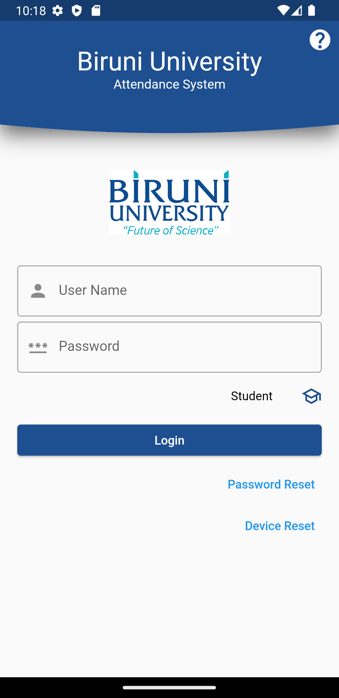
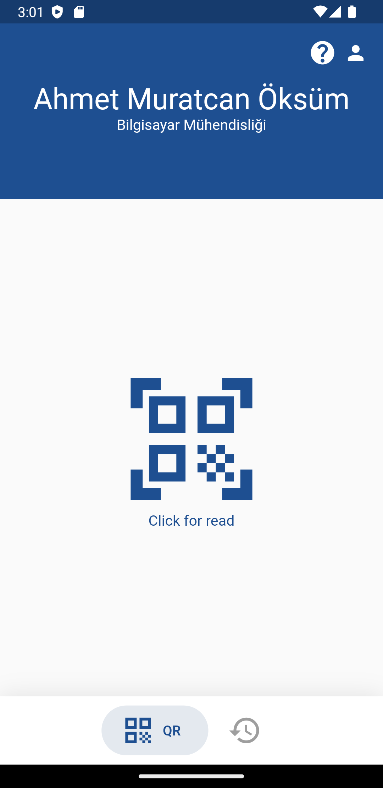
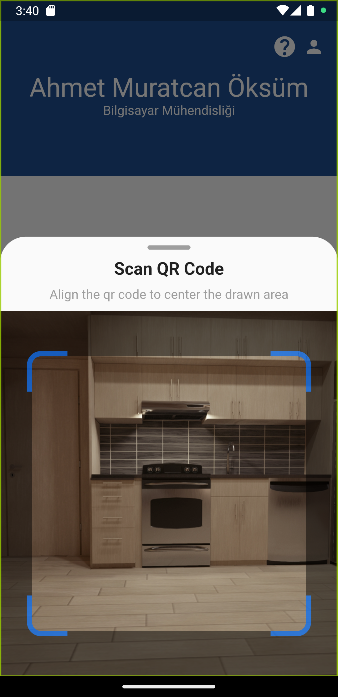
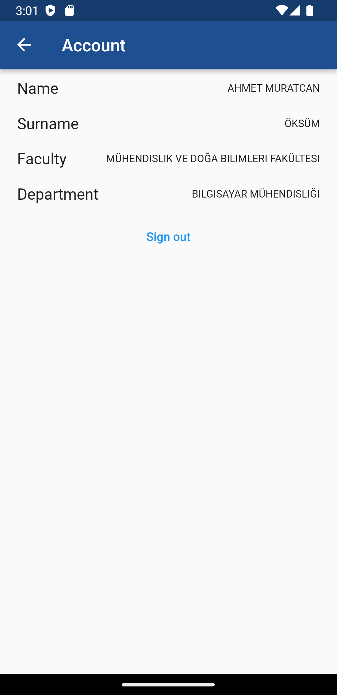
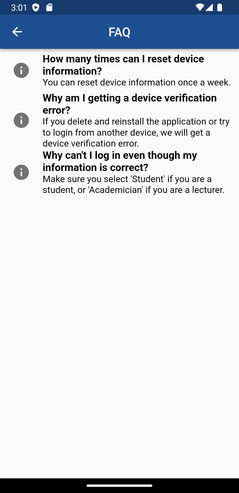

# QR Attendance app

Flutter application for the attendance. The app allows teachers to generate a dynamic QR based on the details of a class and the students to scan it to confirm their attendance.

# Screenshot

